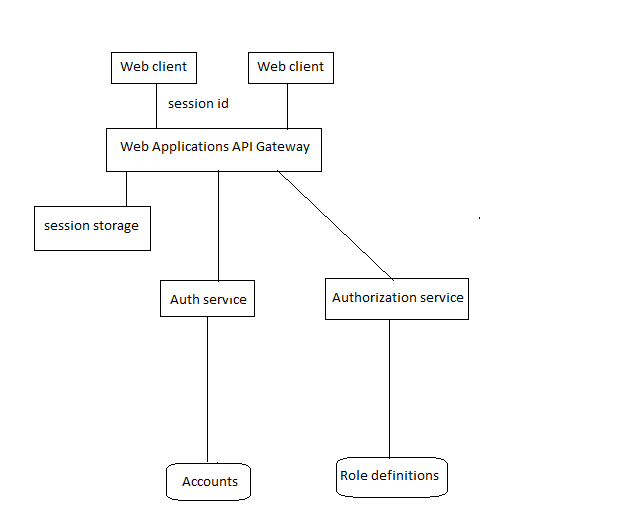

Base set of micro services
=========

Getting started
---------------

Download [Docker](https://www.docker.com/products/overview). If you are on Mac or Windows, [Docker Compose](https://docs.docker.com/compose) will be automatically installed. On Linux, make sure you have the latest version of [Compose](https://docs.docker.com/compose/install/).

Run in this directory:

```docker
docker-compose up
```

```docker
docker-compose stop
```

The app will be running at [http://localhost:4300](http://localhost:43000).

Architecture
-----



* A MongoDb database backed by a Docker volume
* A Redis database backed by a Docker volume
* A Node.js Proxy API
* A Node.js authentication admin service
* A Node.js authentication service
* A Node.js authorization admin service
* A Node.js authorization service
* A Node.js audit admin service
* A Node.js audit service
* A Node.js producer service
* A Node.js background worker service
* Example of An Angular front end SPA - it is not dockernazed.

Folders structure:
----
mcrsrv-curl
mcrsrv-postman
clients
  web-client
micro-services
  compose
  services
    authentication
    authentication-admin
    authorization
    authorization-admin
    audit
    audit-admin
    background
  gateways  
    web-app-api-gtw
    mobile-app-api-gtw
